# Knn-Kmeans
 K-NN and K-means algorithms: A Comprehensive Analysis of 1980s American Market Car Data.

These are - in a nutshell - the main bullet points that have been approached:

+ **File reading (.CSV)**
+ **Check number of records**
+ **Prepare the file for KNN method**
+ **Set 'label' variable**
+ **Normalize file, excluding 'label' variable**
+ **Create normalize function**
+ **Calculate K number of neighbours**
+ **Train the model**
+ **Evaluate the model**
+ **Model improvements**
+ **Z-score**

# Summary
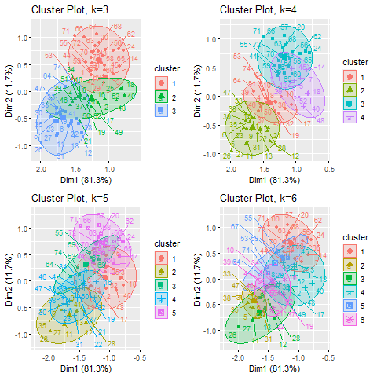 
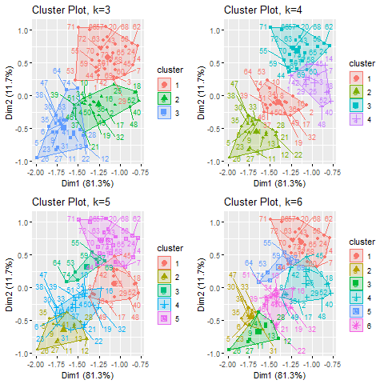 
## Elbow method
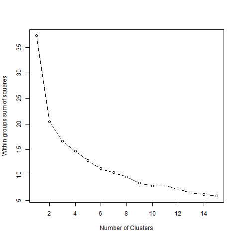
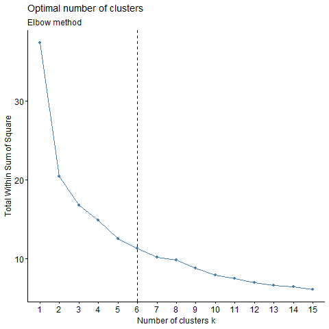
# Numerical correlation matrix
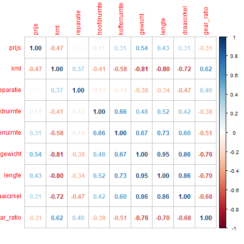
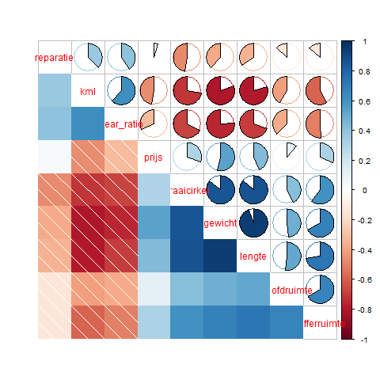
# Variable correlations plot
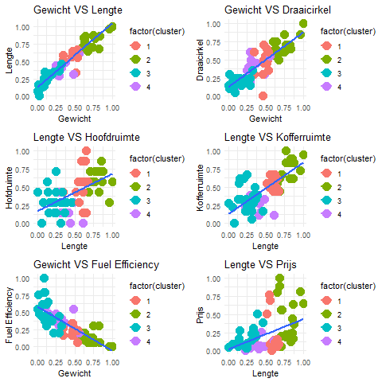
# Cluster content
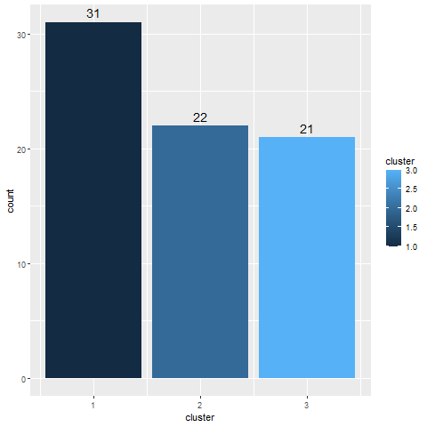
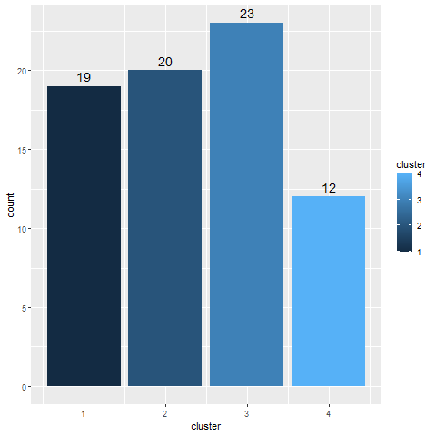
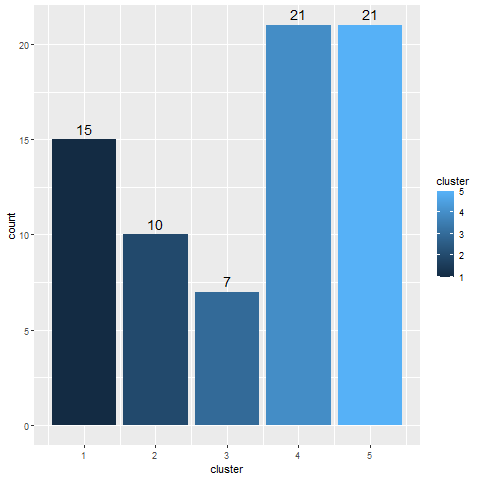
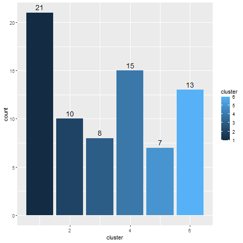
# Cluster plot comparison (k=3,k=4,k=5,k=6)

# Cluster plot convex & normalized (k=3,k=4,k=5,k=6) 
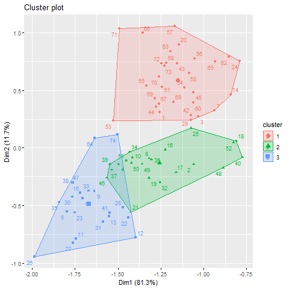
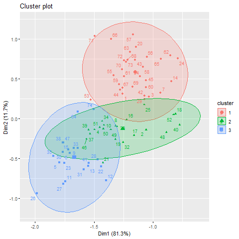
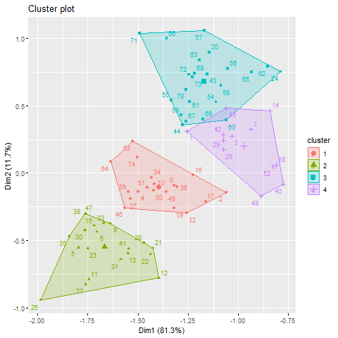
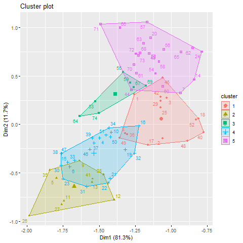
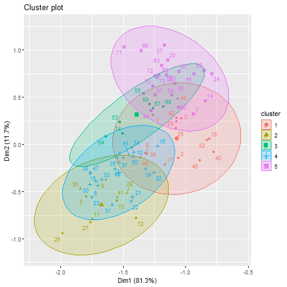
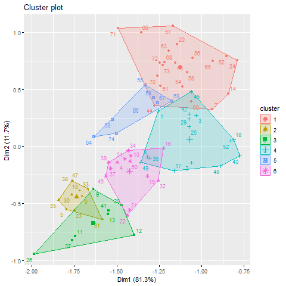
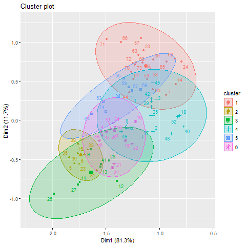
# Correlation matrices HCLUST 
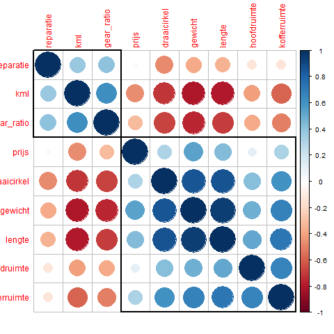
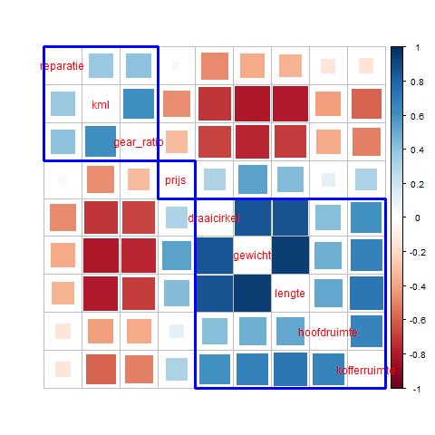

# MCLUST charts
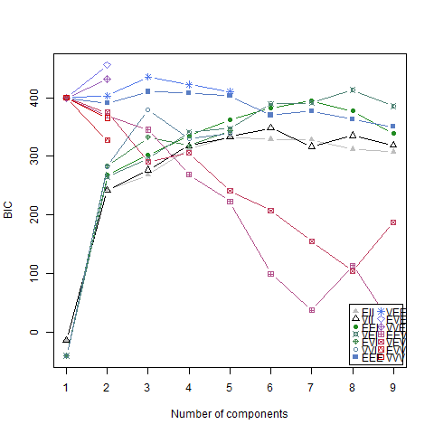
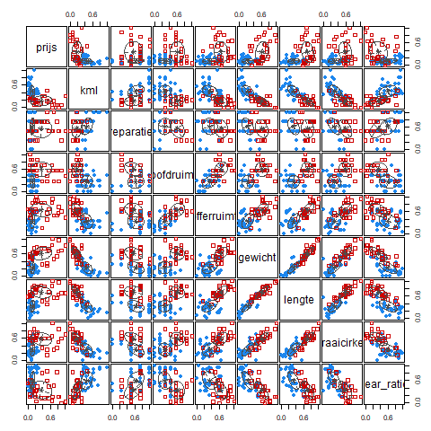

